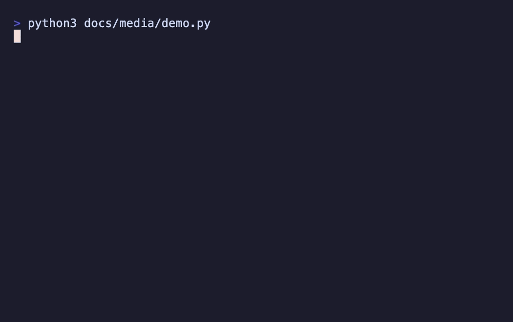
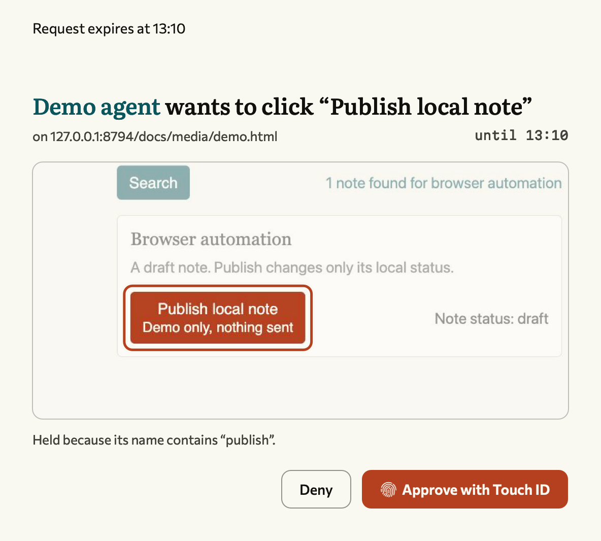
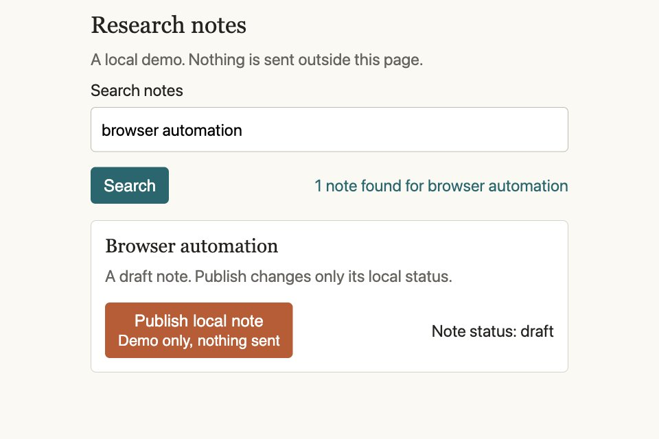

<h1> </h1>

Gaddi is a local [MCP](https://modelcontextprotocol.io/) server that lets AI agents work in your existing Chrome tabs.

It uses the browser and logins you already have. Agents open background task groups, read pages and interact with controls. Claude Code, Codex and other MCP clients share the same connection and approval rules.

I built it because the browser tools I tried were slow, heavy and kept taking focus from my other apps. I wanted one browser connection I could use with any agent.



## You authorize the action

**A held action needs a signed decision from the Mac's owner.** Telling the agent "yes" does not create that signature.

A local broker checks each request before it reaches Chrome. The default policy holds recognized payments, purchases, deletion, security changes and sends, plus every file upload. Gmail Send actions and direct password-field access are refused. Ordinary reading and navigation continue without a prompt unless an address matches a held rule.



*The shipping approval card with its request expiry annotated, using a disposable local page.*

The panel names the action and can show its target on the page. Approve or Deny starts macOS owner authentication: Touch ID or the Mac password. A key held in the [Secure Enclave](https://support.apple.com/guide/security/secure-enclave-sec59b0b31ff/web) signs the decision. The broker binds approval to the pending action and rejects changed requests or reused proofs. There is no software-key fallback.

For sign-ins and eligible sends, **Always allow on this site** remembers the exact origin, including scheme and port. Send buttons and Enter have separate permissions. Remembering and revoking both require a signed owner decision. The shipped lists are empty; payments, deletion, security actions and uploads never offer this choice.

### Where that protection ends

Gaddi guards calls made through Gaddi. It is not a sandbox for an agent that also has your shell access. Its policy matches control names and URLs, mainly in English and Italian; it cannot identify every harmful action or prevent requests a page sends on its own. JavaScript checks can miss obfuscated code.

Pages read through Gaddi go to your agent, including private information visible in logged-in tabs. The extension needs broad site, debugger, bookmark and extension-management access. Review the [default policy](policy/policy.default.json) and [Chrome bridge limits](extension/README.md) before connecting it to sensitive accounts.

## Install

Requires macOS 26+, a Mac with Secure Enclave, [Chrome](https://www.google.com/chrome/), [Node.js](https://nodejs.org/) 22.18+ on the 22.x line or 23.6+, and Xcode to build the approval app. This is a source installation with an ad-hoc-signed Mac app.

```sh
git clone https://github.com/ABCastor/gaddi.git
cd gaddi
npm ci
bash install/register/daemon.sh
bash install/register/app.sh
bash install/register/chrome-bridge.sh
```

In `chrome://extensions`, enable Developer mode, click **Load unpacked** and select `extension/`. Add `~/.local/bin` to your PATH. Keep the checkout in place: the installed components reference it.

Register the clients you use, then restart them. Quit apps that own their configuration before registration.

| Client | Command |
|---|---|
| [Claude Code](https://code.claude.com/docs/en/overview) | `bash install/register/claude-code.sh` |
| [Claude Desktop](https://claude.ai/download) | `bash install/register/claude-desktop.sh` |
| [Codex](https://developers.openai.com/codex/) | `bash install/register/codex.sh` |
| [OpenCode](https://opencode.ai/) | `bash install/register/opencode.sh` |
| Antigravity | `bash install/register/agy.sh` |

Another MCP client can launch `node /absolute/path/to/gaddi/mcp/server.mjs` over stdio. Every installer accepts `--dry-run`. See [configuration and removal](install/README.md).

## Work in a tab

```sh
gaddi status
gaddi open https://example.com --group "Research"
gaddi look <tab-id>
gaddi click <tab-id> '<element-ref>'
gaddi close <tab-id>
```

`open` returns the tab ID; `look` returns text and control references. Keep that ID through the task. MCP tools use the same names with a `browser_` prefix. Agents can also type, scroll, select, wait and take screenshots. Input works in the background; `browser_show` brings a tab to you.



Pass the version from `look` to reject stale input. When a session ends, its background tabs are cleaned up; tabs shown to you are preserved.

### Sign in with 1Password

`browser_signin` uses the [1Password CLI](https://developer.1password.com/docs/cli/) and its desktop-app integration. You authorize the site and Login item; Gaddi fills it and returns an outcome to the agent. Captchas, passkeys and extra verification can still need you.

Credentials are excluded from sign-in results and audit entries. Exact matches are redacted from text tool output for ten minutes after use; screenshot pixels are outside that redaction. See [sign-in and approval details](docs/authorization.md).

Uploads are limited to 20 MB and wait for approval. Protected credential paths and key files are refused, though these checks cannot detect secrets inside arbitrary files. [Extension controls](docs/extension-controls.md) cover restart, enable, held disable/removal and optional local installation. The bridge recovers failed connections without replaying page actions.

## Development

```sh
npm run typecheck
npm run build:extension
bash tests/run-all.sh
```

Tests use isolated state. Gate tests must fail with their protection removed. Browser tests need Chrome for Testing; Secure Enclave checks need a desktop session. Missing prerequisites are reported as skipped. Commit regenerated extension output after source changes. [Visual sources](docs/media/README.md) are included.

There is no console or network inspection, download handling, browser-dialog handling or video recording. CSS and Web Animations can be slowed; JavaScript timers, canvas and video cannot. Licensed under [MIT](LICENSE).

<p><a href="https://abcastor.com"></a></p>
